# Hospital Patient & Operations Database – MySQL

## Project Overview

This project is a Hospital Patient & Operations Database developed using MySQL. It demonstrates database design, data insertion, and advanced SQL concepts to analyze hospital operations, patient admissions, doctor performance, billing, and departmental reports.

The project covers beginner to intermediate SQL concepts along with advanced features like CTEs, Window Functions, Views, and Stored Procedures.

---

## Objectives

- Design a relational hospital database
- Insert realistic hospital data
- Perform patient and billing analysis
- Analyze doctor performance
- Generate monthly hospital reports
- Practice advanced SQL concepts

---

## Database Tables

1. Departments
2. Doctors
3. Patients
4. Admissions
5. Billing
6. Feedback

---

## SQL Concepts Used

- CREATE DATABASE
- CREATE TABLE
- INSERT INTO
- SELECT
- WHERE
- ORDER BY
- GROUP BY
- Aggregate Functions
- INNER JOIN
- LEFT JOIN
- CASE
- DATEDIFF()
- TIMESTAMPDIFF()
- CTE (WITH)
- Window Functions
- RANK()
- Running Total
- CREATE VIEW
- Stored Procedures
- DELIMITER
- CALL

---

## Project Features

- Patient Admission Analysis
- Doctor Performance Report
- Department-wise Revenue
- Billing Summary
- Average Length of Stay
- Monthly Revenue Analysis
- Running Total Calculation
- Department Ranking
- Patient Admission View
- Automated Monthly Report

---

## Expected Outputs

- Patient admission details
- Department-wise average stay
- Billing report
- Readmitted patients
- Doctor ranking
- Running monthly revenue
- View-based reports
- Monthly hospital report

---

## Tools Used

- MySQL Community Server
- MySQL Workbench
- GitHub

---

## 📸 Screenshots

### Setup - Database Created
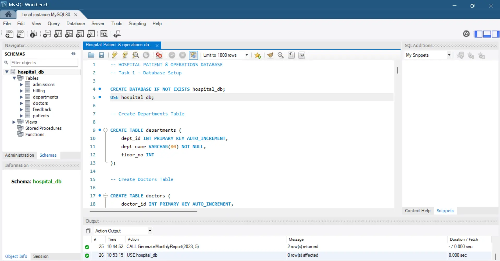

### Task 1 - Show Tables
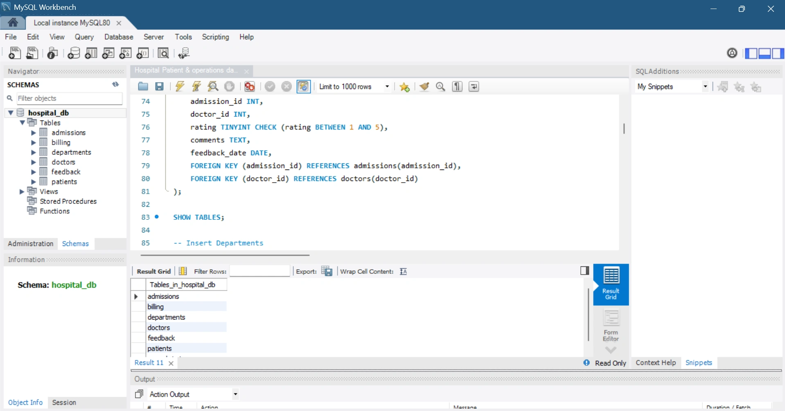

### Task 1 - Patients Table Record Count
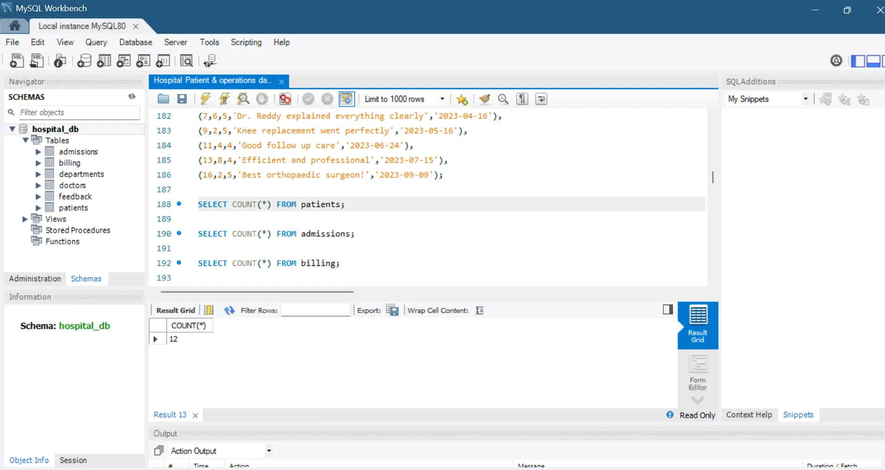

### Task 1 - Admissions Table Record Count
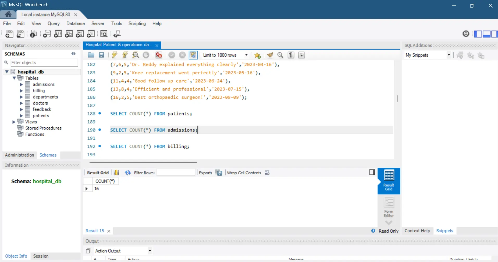

### Task 1 - Billing Table Record Count
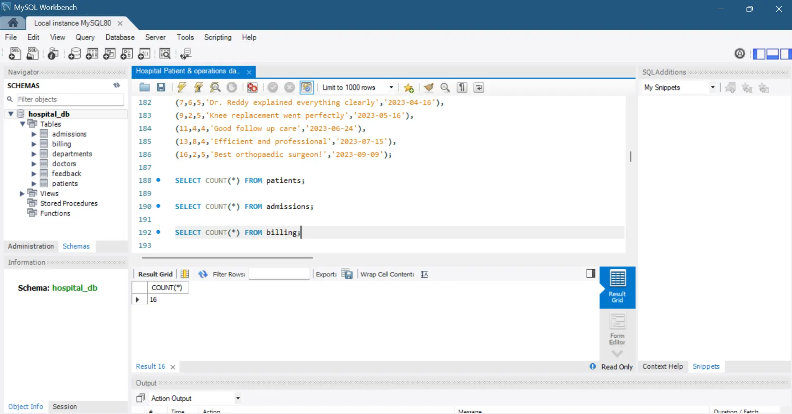

### Task 1 - Query 3a (Patient Admission Details)
.webp)

### Task 1 - Query 3b (Average Stay by Department)
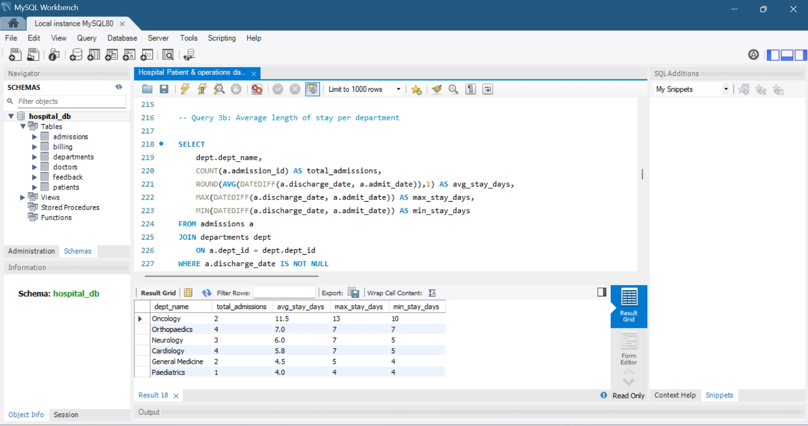

### Task 1 - Query 3c (Billing Breakdown)
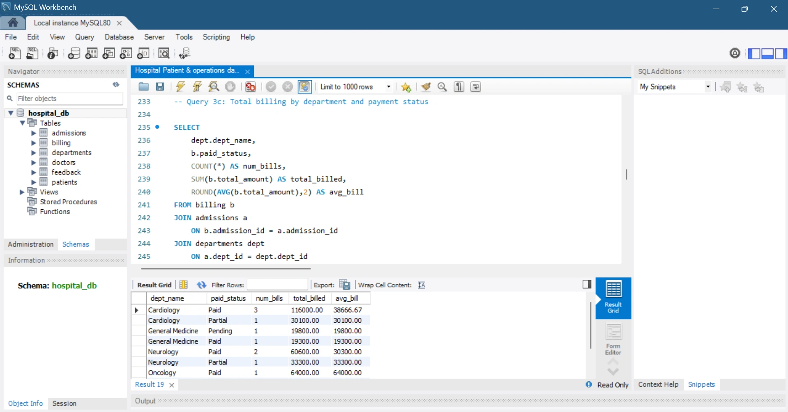

### Task 2 - CTE 1a (Multiple Admissions)
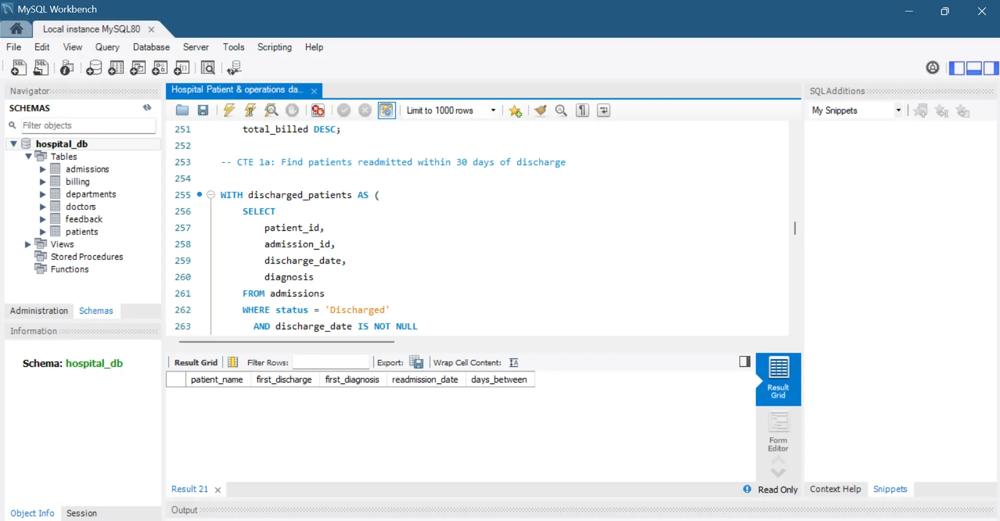

### Task 2 - CTE 1b (Doctor Performance)
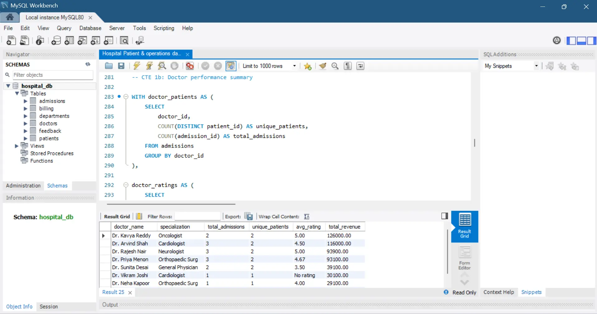

### Task 2 - Window Function 2a (Running Monthly Revenue)
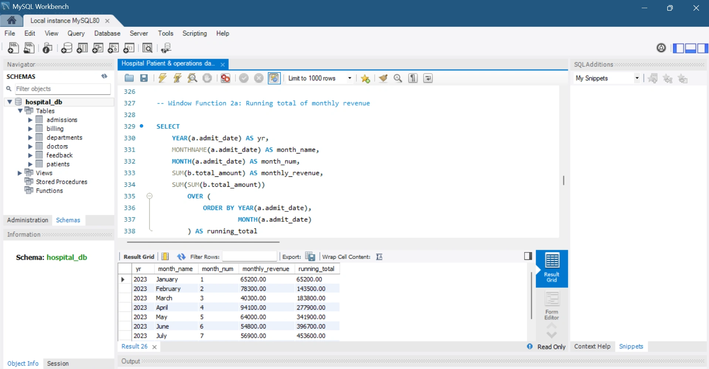

### Task 2 - Window Function 2b (Doctor Ranking)
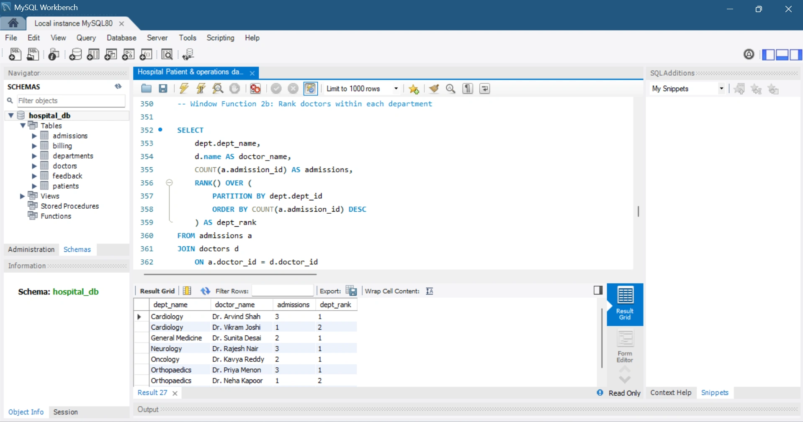

### Task 2 - View Created
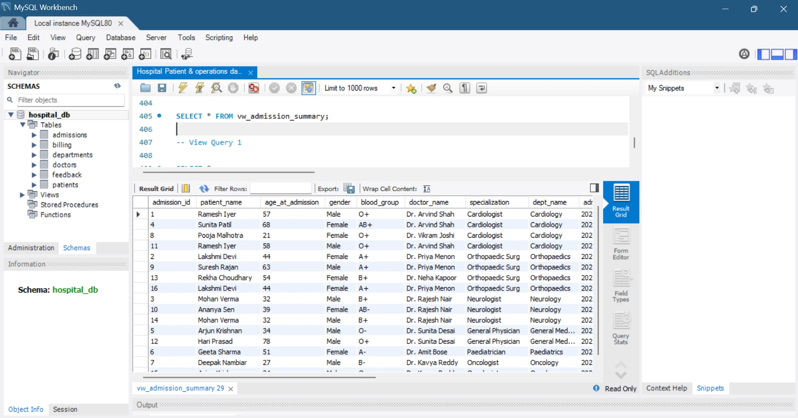

### Task 2 - View Query (Cardiology Patients)
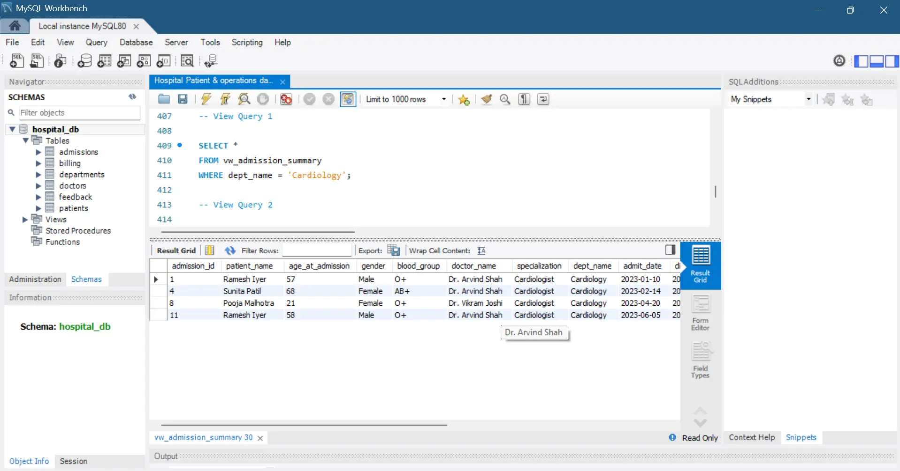

### Task 2 - View Query (Bills Above ₹50,000)
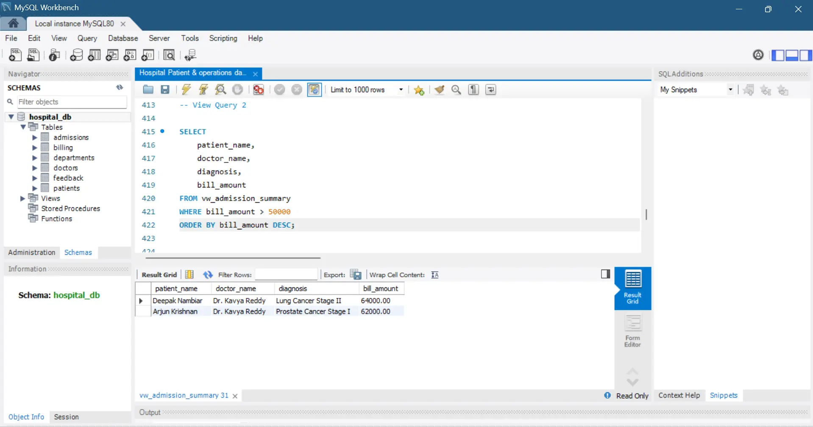

### Task 2 - Stored Procedure Created
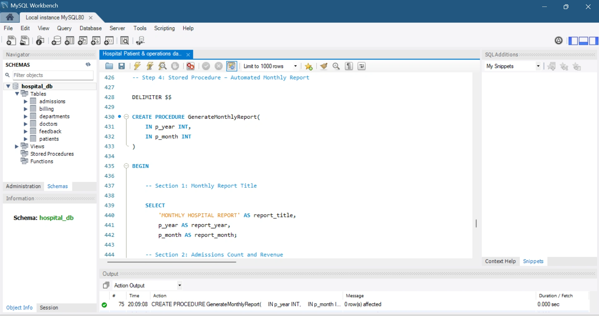

### Task 2 - Monthly Report (January 2023)
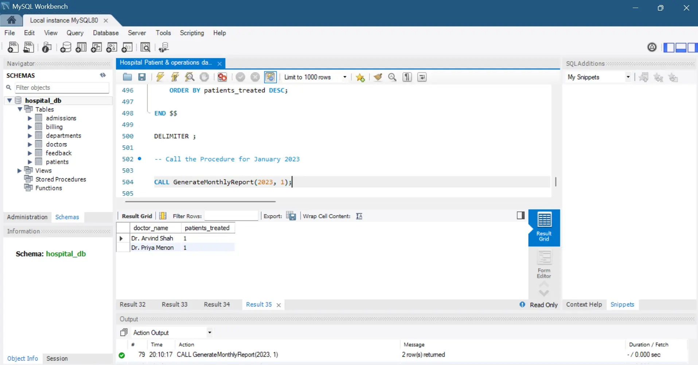

### Task 2 - Monthly Report (May 2023)
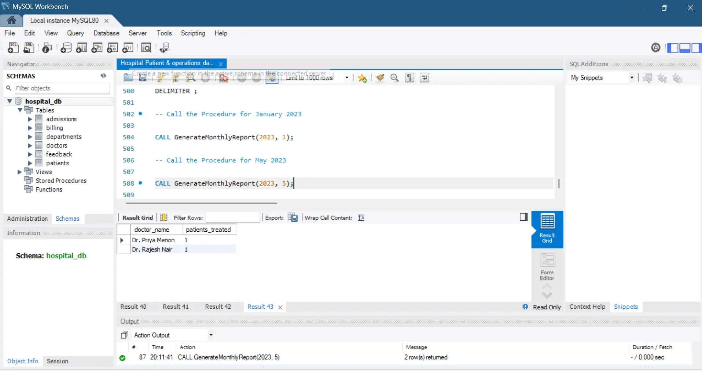

---

## Learning Outcomes

- Relational Database Design
- SQL Query Writing
- Data Analysis
- Multi-table Joins
- Common Table Expressions (CTEs)
- Window Functions
- Views
- Stored Procedures
- Business Reporting

---

## Author

Tanishka Salvi
